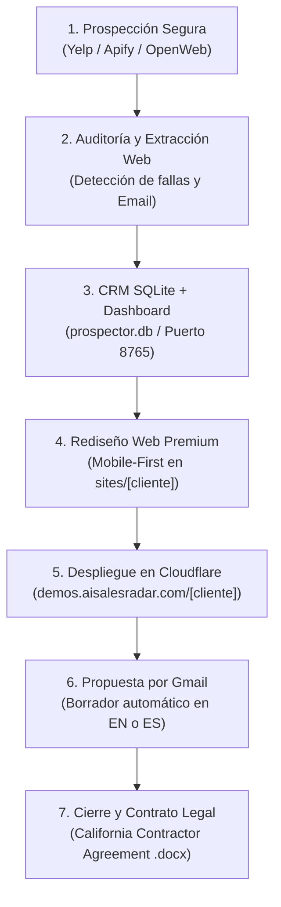

# 📖 Manual de Operaciones y Uso Integral — AI Sales Radar Studio
### Prospector B2B, Generador de Landing Pages, Despliegue en Cloudflare y CRM Automatizado
**Mercado Objetivo:** California / USA (Bilingüe: Inglés y Español)  
**Autor:** Jose Gonzales — AI Sales Radar Studio  
**Versión:** 2.0 (Cloudflare & Multi-Provider Architecture)

---

## 📑 Tabla de Contenidos
1. [Visión General y Arquitectura del Sistema](#1-visión-general-y-arquitectura-del-sistema)
2. [Configuración y Credenciales Activas](#2-configuración-y-credenciales-activas)
3. [Flujo Operativo Completo en el Chat (Paso a Paso)](#3-flujo-operativo-completo-en-el-chat-paso-a-paso)
4. [Estructura de Subdominios y URLs de Demos en Cloudflare](#4-estructura-de-subdominios-y-urls-de-demos-en-cloudflare)
5. [Motor de Prospección Seguro y Búsqueda Manual (CLI)](#5-motor-de-prospección-seguro-y-búsqueda-manual-cli)
6. [Gestión del Dashboard Web y CRM Kanban](#6-gestión-del-dashboard-web-y-crm-kanban)
7. [Envío de Propuestas y Modos de Gmail](#7-envío-de-propuestas-y-modos-de-gmail)
8. [Generación de Contratos Legales para California](#8-generación-de-contratos-legales-para-california)
9. [Preguntas Frecuentes y Solución de Problemas](#9-preguntas-frecuentes-y-solución-de-problemas)

---

## 1. Visión General y Arquitectura del Sistema

El sistema es una plataforma integral de adquisición de clientes B2B orientada a negocios locales solventes en California que poseen excelente reputación (más de 4.5 estrellas y 30+ reseñas), pero pierden ventas debido a sitios web anticuados o no optimizados para teléfonos móviles.



### Componentes de la Solución
- **`prospector.db`**: Base de datos SQLite local (fuente única de la verdad de clientes, estados, propuestas y contratos).
- **`dashboard-server.py` + `iniciar-dashboard.bat`**: Servidor local ligero que sirve el panel Kanban en `http://localhost:8765`.
- **`dashboard.html`**: Interfaz de usuario con alternador de idioma bilingüe `[ ES | EN ]` y persistencia en navegador.
- **`prospectar.py`**: Motor de búsqueda multi-proveedor que reemplaza Google Places API sin riesgos de facturación.
- **`enviar_proposta.py`**: Automatizador de Gmail conectado a `aisalesradar.agency@gmail.com` para crear borradores instantáneos.
- **`wrangler.jsonc` + `publicar-cloudflare.ps1`**: Despliegue automatizado en Cloudflare Workers con Static Assets.
- **`gerar-docx.py`**: Generador de contratos con cláusulas legales para el estado de California.

---

## 2. Configuración y Credenciales Activas

Todos los parámetros se administran de forma centralizada en el archivo `prospector-config.json`:

```json
{
  "firma": {
    "nombre": "Tu Nombre / Agencia",
    "empresa": "Tu Agencia Studio",
    "presentacion_en": "High-Converting Web Designer & Conversion Specialist",
    "presentacion_es": "Especialista en Diseño Web y Conversión para Negocios",
    "telefono": "+1 (000) 000-0000",
    "whatsapp": "10000000000",
    "email": "tu-agencia@gmail.com"
  },
  "envio": {
    "modo": "borrador_gmail",
    "gmail_user": "tu-agencia@gmail.com",
    "gmail_app_password": "TU_APP_PASSWORD_16_LETRAS"
  },
  "cloudflare": {
    "accountId": "TU_CLOUDFLARE_ACCOUNT_ID",
    "projectName": "prospector-sites",
    "customDomain": "tudominio.com",
    "subdomain": "demos"
  },
  "contrato": {
    "prestador_nombre": "Tu Nombre / Razón Social",
    "prestador_empresa": "Tu Empresa LLC",
    "prestador_ein": "",
    "prestador_direccion": "California, USA",
    "estado_jurisdiccion": "California"
  }
}
```

---

## 3. Flujo Operativo Completo en el Chat (Paso a Paso)

El método estándar y más cómodo para operar es mediante el chat de **Antigravity / Claude**. No necesitas memorizar comandos de consola.

### Paso 0: Instalación y Configuración Inicial con IA (Prompt Maestro)

Para desplegar este proyecto por primera vez en cualquier computadora o para cualquier otro usuario, simplemente proporciona el repositorio de GitHub y el siguiente **Prompt Maestro** a tu agente de IA (Antigravity, Claude Code, Cursor o Codex):

```text
Actúa como un Especialista DevOps y de Automatización Senior.
Quiero que instales, configures y dejes 100% verificado y listo para operar este proyecto en mi entorno local:
https://github.com/ThePipis/gemini-prospector

Por favor ejecuta el siguiente protocolo paso a paso de forma autónoma:

1. VERIFICACIÓN DEL ENTORNO:
   - Valida que Python 3.8+ y Node.js/npx estén disponibles en el sistema.
   - Instala las dependencias en Python: pip install "mcp[cli]" python-docx requests httpx.
   - Verifica Wrangler para Cloudflare: npx wrangler --version.

2. ASISTENTE INTERACTIVO DE CONFIGURACIÓN (Paso a Paso):
   No inventes claves ni asumas datos privados. Solicítame uno a uno (en bloques breves y claros) los siguientes datos para armar mi archivo local prospector-config.json a partir de prospector-config.template.json:
   - Datos de mi Agencia: Mi Nombre, Nombre de mi Agencia/Empresa, Teléfono (+1 USA) y Correo comercial.
   - Nichos y Mercado: Nichos de interés en California (ej. Dentistas, Med Spas, Abogados, Contratistas) y Ciudad principal.
   - Conexión Cloudflare: Mi Cloudflare Account ID, Dominio personalizado (ej. midominio.com), Subdominio de demos (ej. demos) y API Token.
   - Conexión Gmail: Correo Gmail de la agencia y Contraseña de Aplicación de 16 caracteres (App Password de Google Account).
   - Opcional: Mi clave de Yelp Fusion API si deseo las 500 búsquedas diarias gratis.

3. INICIALIZACIÓN Y SEGURIDAD:
   - Crea el archivo local prospector-config.json con mis datos reales y verifica que esté protegido dentro de .gitignore para que nunca se suba a ningún repositorio.
   - Inicializa la base de datos prospector.db con el esquema SQLite correspondiente.
   - Asegura la sincronización del dashboard.html con el selector bilingüe ES/EN.

4. BATERÍA DE PRUEBAS AUTOMATIZADA:
   - Ejecuta: python prospector-mcp.py --teste
   - Ejecuta: python prospectar.py --probar
   - Valida la autenticación de mi Gmail (SMTP/IMAP) para confirmar que la contraseña de aplicación funcione.

5. CONFIRMACIÓN FINAL:
   - Al finalizar con éxito, infórmame que el sistema está 100% listo para usar, explícame cómo abrir el dashboard (iniciar-dashboard.bat) y cómo darte la orden para comenzar mi primera prospección en lenguaje natural.
```

---

### Paso 1: Abrir el Tablero de Control
1. Da doble clic en el archivo `iniciar-dashboard.bat` en la carpeta raíz `d:\GenWebSite\`.
2. Se abrirá tu navegador en `http://localhost:8765`.
3. Podrás cambiar entre Español e Inglés en cualquier momento con el botón `[ ES | EN ]` del menú superior.

### Paso 2: Lanzar Prospección
En el chat, escribe en lenguaje natural el nicho y la ciudad de California:
- *"Prospecta 10 dentistas en Los Angeles"*
- *"Busca 10 med spas en San Diego"*
- *"Find 10 personal injury lawyers in Irvine"*

**Resultado:** El sistema busca los negocios, analiza sus páginas web, extrae su email y teléfono, los registra en `prospector.db` y los coloca en la columna **"Nuevo / New"** de tu panel Kanban.

### Paso 3: Rediseñar los Mejores Candidatos
Revisas los prospectos en tu panel y seleccionas cuáles rediseñar:
- *"Rediseña el sitio de Downtown Dental Los Angeles en inglés"*
- *"Rediseña los 3 mejores prospectos en español"*

**Resultado:** La IA genera una versión moderna, ultrarrápida y adaptada para teléfonos móviles en la carpeta `sites/[slug]/`. El card avanza a **"Rediseñado / Redesigned"**.

### Paso 4: Publicar en Cloudflare
Cuando el rediseño esté listo:
- *"Publica en Cloudflare"* (o ejecuta `publicar-cloudflare.bat`)

**Resultado:** El sitio se sube a tu subdominio de demostración (`https://demos.aisalesradar.com/[slug]/`). El card se mueve a **"Publicado / Published"**.

### Paso 5: Generar y Enviar la Propuesta
Indica el cliente y el idioma que prefieras para la propuesta:
- *"Genera la propuesta en inglés para Downtown Dental"*
- *"Genera la propuesta en español para Clínica Dental San Diego"*

**Resultado:** El sistema crea automáticamente un borrador en tu Gmail (`aisalesradar.agency@gmail.com`) con el asunto optimizado, rapport personalizado, enlace a la demo comparadora y firma profesional. El card avanza a **"Propuesta enviada / Proposal sent"**.

### Paso 6: Cerrar Venta y Generar Contrato
Una vez que el cliente responde positivamente y acuerdan el precio:
- *"Genera el contrato para Downtown Dental por $700 de diseño y $100 de mantenimiento mensual"*

**Resultado:** El sistema genera el contrato legal en formato Word bloqueado (`.docx`) y HTML listo para firmar. Arrastras la tarjeta a **"Cerrado / Closed"**, y las cifras se reflejan en la pestaña **Financiero**.

---

## 4. Estructura de Subdominios y URLs de Demos en Cloudflare

### ¿Cómo funciona la asignación de URLs de demostración?
Reutilizamos tu dominio corporativo `aisalesradar.com` sin costo adicional mediante el subdominio dedicado:
$$\text{https://demos.aisalesradar.com/\{slug\}/}$$

Cada cliente recibe automáticamente un identificador único y amigable (*slug*):
- Negocio: **Smith Plastic Surgery** en Beverly Hills $\to$ `smith-plastic-surgery-beverly-hills`
- URL de la Propuesta / Comparador:  
  `https://demos.aisalesradar.com/smith-plastic-surgery-beverly-hills/proposta.html`
- URL del Sitio Rediseñado:  
  `https://demos.aisalesradar.com/smith-plastic-surgery-beverly-hills/smith-plastic-surgery-beverly-hills.html`

### ¿Qué pasa cuando el cliente compra el sitio?
1. La demo en `demos.aisalesradar.com` cumple únicamente un rol de **presentación y venta**.
2. Cuando el cliente firma y paga:
   - **Opción A (Dominio en su registrador actual)**: Se le entregan los archivos HTML/CSS/JS limpios para subirlos a su hosting, o se redirigen sus DNS (registros A / CNAME) hacia Cloudflare.
   - **Opción B (Gestión completa por tu agencia)**: Agregas su dominio propio (ej. `smithplasticsurgery.com`) a tu cuenta de Cloudflare y apuntas el proyecto Workers a su dominio raíz.

---

## 5. Motor de Prospección Seguro y Búsqueda Manual (CLI)

Si prefieres buscar clientes directamente desde la consola de Windows sin consumir tokens en el chat, puedes utilizar el ejecutable `prospectar.py`.

### Comandos de Ejemplo

```powershell
# 1. Búsqueda gratuita abierta (sin API keys ni registros):
python prospectar.py --nicho "dentists" --ciudad "Los Angeles" --limite 10

# 2. Búsqueda con Yelp Fusion API (Recomendado para California - 500/día gratis):
python prospectar.py --proveedor yelp --nicho "med spas" --ciudad "San Diego" --limite 10

# 3. Búsqueda con Apify (Google Maps Scraper con créditos prepagos):
python prospectar.py --proveedor apify --nicho "personal injury attorneys" --ciudad "Irvine" --limite 10

# 4. Probar extractor web de contactos:
python prospectar.py --probar
```

### Argumentos del Comando `prospectar.py`
| Parámetro | Descripción | Valor por Defecto |
| :--- | :--- | :--- |
| `--nicho` | Categoría de negocio (`dentists`, `med spas`, `cpas`, `hvac`, etc.) | `dentists` |
| `--ciudad` | Ciudad de California (`Los Angeles`, `San Diego`, `San Jose`, etc.) | `Los Angeles` |
| `--estado` | Estado de USA | `CA` |
| `--limite` | Cantidad de prospectos a calificar | `5` |
| `--proveedor` | Fuente de datos (`auto`, `yelp`, `apify`, `openweb`) | `auto` |

### Cómo obtener la API Key Gratuita de Yelp (500 búsquedas al día sin tarjeta)
1. Entra a [yelp.com/developers/v3/manage_app](https://www.yelp.com/developers/v3/manage_app) con cualquier cuenta de correo.
2. Crea una app gratuita con el nombre `Prospector Lead Finder`.
3. Yelp te entregará una clave llamada `API Key`.
4. Pégala en `prospector-config.json` en el campo `"yelp_api_key": "TU_KEY"`.
5. **Seguridad**: Yelp nunca te pedirá tarjeta de crédito para la API y nunca te cobrará; al llegar al límite diario de 500 llamadas simplemente responde `429 Too Many Requests`.

---

## 6. Gestión del Dashboard Web y CRM Kanban

El dashboard (`http://localhost:8765`) incluye todas las herramientas de gestión:

### 1. Selector de Idioma `[ ES | EN ]`
Ubicado en la esquina superior derecha del topbar. Permite alternar instantáneamente entre Español e Inglés sin recargar la página. Recuerda tu elección para futuras visitas.

### 2. Vistas Principales
- **Visión General**: Métricas clave en USD, embudo visual de prospectos y alertas de seguimiento (4+ días sin respuesta).
- **Pipeline Kanban**: Tablero arrastrable con etapas:
  - *Nuevo* $\to$ *Rediseñado* $\to$ *Publicado* $\to$ *Propuesta enviada* $\to$ *Respondió* $\to$ *Cerrado* $\to$ *Descartado*.
- **Clientes**: Tabla paginada de todos los negocios con buscador rápido, notas, reseñas y enlaces directos a sus sitios.
- **Sitios Web**: Galería visual con previsualización en miniatura de cada landing page generada y acceso al editor interactivo.
- **Comparador (Before & After)**: Pestañas interactivas que muestran lado a lado la web actual del cliente frente a tu nueva versión moderna.
- **Seguimientos**: Lista de control para clientes que no han respondido en 4 días, con enlace directo para escribirles por WhatsApp o correo.
- **Contratos**: Historial de acuerdos legales (pendiente, enviado, firmado), con visualizador PDF y enlace de descarga `.docx`.
- **Financiero**: Control de caja (ingresos cobrados, por cobrar, ingresos recurrentes mensuales MRR y proyección anual).
- **Configuración**: Edición de datos fiscales del contratista y credenciales de Cloudflare.

---

## 7. Envío de Propuestas y Modos de Gmail

La cuenta oficial de la agencia es **`aisalesradar.agency@gmail.com`** y ya se encuentra autenticada mediante App Password.

### Generación de Propuestas con `enviar_proposta.py`

Puedes pedirle a Claude o ejecutarlo en consola:
```powershell
# 1. Crear borrador automático en Gmail en INGLÉS:
python enviar_proposta.py --slug "dr-smith-dentistry-los-angeles" --idioma en --modo borrador

# 2. Crear borrador automático en Gmail en ESPAÑOL:
python enviar_proposta.py --slug "clinica-dental-san-diego" --idioma es --modo borrador

# 3. Correo de seguimiento (Día 3-4):
python enviar_proposta.py --slug "dr-smith-dentistry-los-angeles" --idioma en --modo borrador --followup

# 4. Generar enlace de redacción web directa (Compose URL):
python enviar_proposta.py --slug "dr-smith-dentistry-los-angeles" --modo link
```

### Reglas Anti-Spam Obligatorias
- **Un solo enlace**: Dirigido únicamente a la URL de demostración en Cloudflare.
- **Sin acortadores**: Jamás usar bit.ly ni enlaces sospechosos.
- **Sin precios en el primer contacto**: El precio se debate una vez que el cliente ve la calidad del trabajo.
- **Cero palabras de alerta de spam**: Prohibido usar "gratis", "descuento", "oferta única", "urgente" o signos de exclamación múltiples (`!!`).

---

## 8. Generación de Contratos Legales para California

Cada vez que cierres un trato comercial, el sistema genera un **Acuerdo de Prestación de Servicios de Contratista Independiente** (*Independent Contractor Agreement*) sujeto a las leyes del Estado de California.

### Opciones de Idioma del Contrato
- **Inglés**: `sites/[cliente]/contrato-[cliente].docx` (Estándar para empresas estadounidenses).
- **Español**: `sites/[cliente]/contrato-[cliente]-es.docx` (Para clientes hispanohablantes).

### Cómo Generarlo
En el chat, simplemente indica:
> *"Genera el contrato para [Nombre del Cliente] por $700 de diseño y $100 de mantenimiento mensual"*

El documento Word generado sale con campos protegidos, estipulación de propiedad intelectual para el cliente tras el pago final, y cláusula de jurisdicción exclusiva en el Estado de California.

---

## 9. Preguntas Frecuentes y Solución de Problemas

#### ¿Qué hago si al abrir `iniciar-dashboard.bat` sale un error de puerto ocupado?
El servidor utiliza el puerto estándar `8765`. Si estuviera ocupado por otra instancia, puedes cerrarla en PowerShell:
```powershell
Stop-Process -Id (Get-NetTCPConnection -LocalPort 8765).OwningProcess -Force
```

#### ¿Cómo agrego más ciudades o nichos a la prospección?
Edita el archivo `prospector-config.json` en la sección `"prospeccion" -> "nichos"` o simplemente pídelo en el chat:
> *"Prospecta techadores (roofing contractors) en San Jose, CA"*

#### ¿Los datos de mis clientes se suben a servidores externos?
**No.** Toda la base de datos de leads, presupuestos, contratos y finanzas se almacena de forma privada y local en tu archivo `prospector.db`. Lo único que se publica en internet son los archivos estáticos HTML/CSS de las demos en tu cuenta personal de Cloudflare.

#### ¿Dónde veo las demos generadas antes de enviarlas?
Puedes abrirlas localmente en tu computadora desde la carpeta `d:\GenWebSite\sites\[cliente]\[cliente].html` o visualizarlas directamente en la pestaña **Sitios Web** o **Comparador** de tu dashboard.
